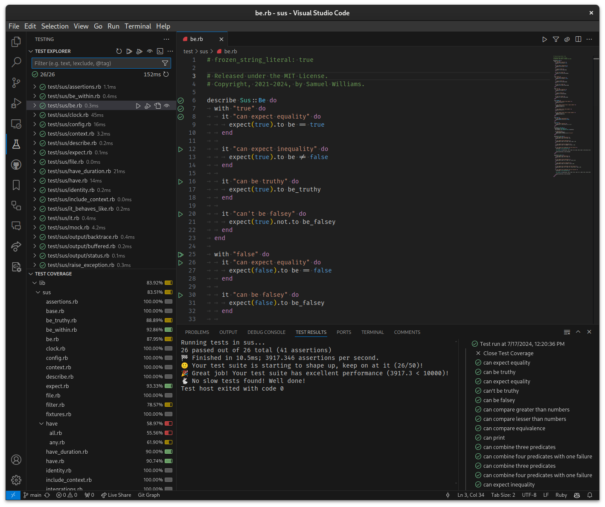

# Sus VSCode Test Provider

Experimental extension for showing tests in VSCode.

## Usage

### Environment Variables

In some cases, you might want to specify a custom `BUNDLE_GEMFILE` or other environment variables that need to be set before the test suite is loaded. You can do this by defining a `.env.sus` dotenv file in the root of your project. This file will be loaded by the extension and the environment variables will be set before any commands are run.

## Debugging

- Check out the code.
- Run `npm install` to install dependencies.
- Open the code in an editor.
- Run the `Run Extension` target in the Debug View. This will:
	- Start a task `npm: watch` to compile the code.
	- Run the extension in a new code window.
- Open the `sus` repo in the new code window.
- Check the `Tests` sidebar icon.
